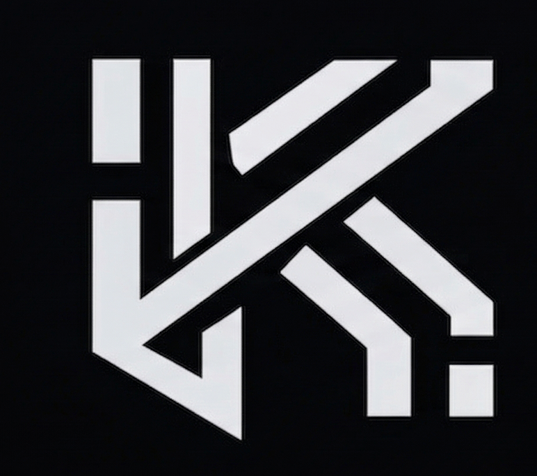

# CitaZero — Estado actual del proyecto (17 abril 2026)

## Objetivo de este documento

Este documento contiene el estado completo del sitio web **CitaZero** (antes Kinetic Ops). Incluye el código fuente íntegro, la estructura de archivos, las decisiones tomadas y el contexto necesario para que puedas analizarlo y proponer mejoras concretas.

**Lo que necesito de ti:** léelo entero, analiza el código, identifica puntos débiles (de diseño, conversión, UX, copy, SEO, rendimiento) y dame un briefing de mejoras estructurado con instrucciones precisas que pueda copiar y pegar a mi agente de código para que las ejecute directamente.

---

## Información del negocio

| Campo | Valor |
|---|---|
| Nombre de marca | **CitaZero** |
| Sector | SaaS / Automatización IA para PYMES |
| Producto | Recepcionista IA por WhatsApp que agenda, modifica, cancela y recuerda citas de forma autónoma |
| Público objetivo | Dueños de PYMES con agenda de citas: clínicas dentales, fisioterapeutas, centros de estética, gimnasios, talleres mecánicos, abogados, academias, peluquerías |
| Modelo de negocio | Instalación única (147€) + suscripción mensual (90€/mes, sin permanencia) |
| Teléfono único | +34 711 23 41 71 |
| Email único | equipocitazero@gmail.com |
| WhatsApp | https://wa.me/34711234171 |
| Tono | Formal "usted", profesional, orientado a infraestructura |
| Fundadores | Sr. Daniel y Sr. Carlos (CEOs y Fundadores) |
| Dominio previsto | https://citazero.com |

---

## Stack técnico actual

- **HTML autocontenido** — un solo archivo `index.html`
- **Tailwind CSS** vía CDN (`cdn.tailwindcss.com`)
- **Google Fonts** — Inter Tight (300–800)
- **JavaScript vanilla** — animaciones, chat WhatsApp, contador de plazas
- **Sin framework** (no React, no Vite, no build step)
- **Sin dependencias npm** — todo autocontenido

---

## Estructura de archivos

```
kinetic-ops-web/
├── index.html                    ← Landing page completa (765 líneas)
├── favicon.svg                   ← Icono calendario + check
├── robots.txt                    ← Directivas SEO
├── sitemap.xml                   ← Mapa del sitio
├── logo-kinetic.png              ← Logo (icono abstracto, se usa en nav/footer)
├── VIDEO FINAL LANDING.mp4       ← Vídeo demostrativo (~230 MB)
├── Thumbnail del vídeo .jpg      ← Poster del vídeo
├── Logos Empresas/
│   ├── Herramientas/             ← Logos integraciones (Gmail, WhatsApp, Sheets, etc.)
│   │   ├── 1.png ... 7.png
│   └── Lideres/                  ← Logos marcas de confianza (Vitaldent, Sanitas, etc.)
│       ├── Vitaldent.png, Sanitas.png, etc.
├── index.html.bak                ← Backup de versión anterior (Kinetic Ops)
└── [Fotos antiguas]              ← Foto CEO.png, Foto Carlos co fouden.jpeg, profile-1/2/3.png
                                    (ya no se referencian en el código)
```

---

## Orden actual de secciones (de arriba a abajo)

1. **Barra de urgencia fija** — "Solo quedan X plazas este mes" (contador dinámico semanal)
2. **Nav flotante** — Logo + CitaZero | Demo · Sectores · Precios · FAQ | CTA "Solicitar instalación"
3. **Hero** — H1 SEO + subtítulo + 2 CTAs + prueba social
4. **Demo WhatsApp** — 3 pestañas (Agendar / Modificar / Recordar) con chat animado estilo WA real
5. **Sectores** — Grid 4×2 con 8 verticales (dentistas, fisio, estética, gimnasios, talleres, abogados, academias, peluquerías)
6. **Resultados reales** — 3 testimonios con monogramas (sin fotos), badge "Verificado"
7. **Precios** — Tarjeta única oscura con 8 ítems + badge "Sin permanencia" + CTA
8. **Vídeo** — Sección con reproductor manual y poster
9. **FAQ** — 6 preguntas en acordeón
10. **CTA final** — Sección oscura con fundadores (texto, sin fotos) + WhatsApp + llamada + email
11. **Botón WhatsApp flotante** — Esquina inferior derecha
12. **Footer** — Logo + marca + links legales + copyright

---

## Código fuente completo: index.html

```html
<!DOCTYPE html>
<html lang="es" class="scroll-smooth">
<head>
    <meta charset="UTF-8">
    <meta name="viewport" content="width=device-width, initial-scale=1.0">
    <title>CitaZero — Automatización de citas por WhatsApp con IA para PYMES</title>
    <meta name="description" content="CitaZero instala infraestructura de agendamiento automático por WhatsApp con IA para clínicas, talleres, gimnasios y profesionales. Captura, cualifica, agenda, modifica y recuerda citas sin intervención humana.">
    <meta name="keywords" content="CitaZero, agendamiento automático, IA WhatsApp, automatización citas, bot agendamiento, PYMES, reservas automáticas, recordatorios WhatsApp, asistente virtual clínica dental, automatización gimnasios, reservas taller mecánico">
    <meta name="author" content="CitaZero">
    <meta name="robots" content="index, follow, max-image-preview:large, max-snippet:-1">
    <meta name="language" content="es">
    <meta name="geo.region" content="ES">
    <link rel="canonical" href="https://citazero.com/">

    <!-- Open Graph -->
    <meta property="og:type" content="website">
    <meta property="og:locale" content="es_ES">
    <meta property="og:site_name" content="CitaZero">
    <meta property="og:title" content="CitaZero — Agende, modifique y recuerde citas por WhatsApp con IA">
    <meta property="og:description" content="Infraestructura de automatización IA para agendamiento por WhatsApp. Instalación + suscripción mensual. Sin permanencia.">
    <meta property="og:url" content="https://citazero.com/">
    <meta property="og:image" content="https://citazero.com/og-image.jpg">
    <meta property="og:image:width" content="1200">
    <meta property="og:image:height" content="630">

    <!-- Twitter Card -->
    <meta name="twitter:card" content="summary_large_image">
    <meta name="twitter:title" content="CitaZero — Agendamiento automático por WhatsApp con IA">
    <meta name="twitter:description" content="Infraestructura de crecimiento para PYMES. Capture, cualifique y agende sin intervención humana.">
    <meta name="twitter:image" content="https://citazero.com/og-image.jpg">

    <!-- Favicon -->
    <link rel="icon" type="image/svg+xml" href="favicon.svg">

    <!-- Fonts -->
    <link rel="preconnect" href="https://fonts.googleapis.com">
    <link rel="preconnect" href="https://fonts.gstatic.com" crossorigin>
    <link href="https://fonts.googleapis.com/css2?family=Inter+Tight:wght@300;400;500;600;700;800&display=swap" rel="stylesheet">

    <!-- Tailwind -->
    <script src="https://cdn.tailwindcss.com"></script>
    <script>
        tailwind.config = {
            theme: {
                extend: {
                    colors: {
                        brand: { primary: '#1A1F2C', secondary: '#22C55E', accent: '#F8FAFC' },
                        wa: { bg: '#ECE5DD', green: '#DCF8C6', dark: '#075E54', header: '#128C7E', check: '#53BDEB' }
                    },
                    fontFamily: { sans: ['"Inter Tight"', 'system-ui', '-apple-system', 'sans-serif'] },
                }
            }
        }
    </script>

    <!-- Schema.org JSON-LD -->
    <script type="application/ld+json">
    {
      "@context": "https://schema.org",
      "@graph": [
        {
          "@type": "Organization",
          "@id": "https://citazero.com/#organization",
          "name": "CitaZero",
          "url": "https://citazero.com",
          "logo": "https://citazero.com/favicon.svg",
          "description": "Infraestructura de automatización IA para agendamiento por WhatsApp dirigida a PYMES.",
          "contactPoint": {
            "@type": "ContactPoint",
            "telephone": "+34711234171",
            "contactType": "customer service",
            "email": "equipocitazero@gmail.com",
            "availableLanguage": ["Spanish"]
          },
          "founder": [
            { "@type": "Person", "name": "Sr. Daniel" },
            { "@type": "Person", "name": "Sr. Carlos" }
          ]
        },
        {
          "@type": "Service",
          "name": "Automatización de citas por WhatsApp con IA",
          "provider": { "@id": "https://citazero.com/#organization" },
          "areaServed": "ES",
          "serviceType": "Agendamiento automatizado con IA"
        },
        {
          "@type": "FAQPage",
          "mainEntity": [
            {
              "@type": "Question",
              "name": "¿En cuánto tiempo está operativo el sistema tras la instalación?",
              "acceptedAnswer": { "@type": "Answer", "text": "El sistema queda operativo en un plazo de 48 a 72 horas laborables tras la instalación. Incluye configuración completa, integración con su calendario y herramientas, personalización de la IA con sus servicios y pruebas de funcionamiento." }
            },
            {
              "@type": "Question",
              "name": "¿Se integra con mi agenda o CRM actual?",
              "acceptedAnswer": { "@type": "Answer", "text": "Sí. CitaZero se integra con Google Calendar, Outlook, Calendly y los principales CRM del mercado. Adaptamos la conexión a las herramientas que usted ya utiliza." }
            },
            {
              "@type": "Question",
              "name": "¿Qué ocurre con los datos de mis clientes? ¿Están seguros?",
              "acceptedAnswer": { "@type": "Answer", "text": "Utilizamos las APIs oficiales de Meta (WhatsApp Business) y OpenAI. Sus datos se transmiten de forma cifrada y se almacenan en bases de datos seguras. Cumplimos con la normativa europea de protección de datos (RGPD)." }
            },
            {
              "@type": "Question",
              "name": "¿Qué pasa si WhatsApp cambia sus condiciones?",
              "acceptedAnswer": { "@type": "Answer", "text": "Trabajamos exclusivamente con la API oficial de WhatsApp Business, respaldada por Meta. Ante cualquier cambio de condiciones, nuestro equipo adapta la integración sin coste adicional para usted. Su servicio nunca se interrumpe." }
            },
            {
              "@type": "Question",
              "name": "¿Necesito contratar personal adicional para gestionarlo?",
              "acceptedAnswer": { "@type": "Answer", "text": "No. CitaZero funciona de manera completamente autónoma. No necesita dedicar personal a responder mensajes ni a gestionar la agenda. El sistema captura, cualifica y agenda sin intervención humana." }
            },
            {
              "@type": "Question",
              "name": "¿Puedo cancelar en cualquier momento?",
              "acceptedAnswer": { "@type": "Answer", "text": "Sí. No existen permanencias ni penalizaciones. Puede cancelar su suscripción cuando lo desee. Estamos tan seguros de que verá resultados que no necesitamos atarle con contratos." }
            }
          ]
        }
      ]
    }
    </script>

    <style>
        body { font-family: 'Inter Tight', system-ui, sans-serif; -webkit-font-smoothing: antialiased; }
        [id] { scroll-margin-top: 100px; }

        /* Reveal animations */
        .animate-reveal { opacity: 0; transform: translateY(30px); transition: opacity 0.9s cubic-bezier(0.22,1,0.36,1), transform 0.9s cubic-bezier(0.22,1,0.36,1); }
        .animate-reveal-visible { opacity: 1; transform: translateY(0); }
        .stagger-1 { transition-delay: 0.1s; } .stagger-2 { transition-delay: 0.2s; } .stagger-3 { transition-delay: 0.3s; } .stagger-4 { transition-delay: 0.4s; } .stagger-5 { transition-delay: 0.5s; }

        /* Nav scroll */
        .nav-scrolled { padding-top: 0.5rem !important; padding-bottom: 0.5rem !important; }
        .nav-scrolled .nav-inner { padding-top: 0.5rem !important; padding-bottom: 0.5rem !important; box-shadow: 0 4px 30px rgba(0,0,0,0.1) !important; }

        /* Pulse AI */
        .pulse-ai { animation: pulse-green 2s infinite; }
        @keyframes pulse-green { 0% { box-shadow: 0 0 0 0 rgba(34,197,94,0.7); } 70% { box-shadow: 0 0 0 10px rgba(34,197,94,0); } 100% { box-shadow: 0 0 0 0 rgba(34,197,94,0); } }

        /* Gradient text */
        .text-gradient-green { background: linear-gradient(90deg, #22C55E, #34d399, #06b6d4, #22C55E); background-size: 200% auto; -webkit-background-clip: text; -webkit-text-fill-color: transparent; background-clip: text; animation: gradient-shift 3s linear infinite; }
        .text-gradient-red { background: linear-gradient(90deg, #EF4444, #f97316, #dc2626, #EF4444); background-size: 200% auto; -webkit-background-clip: text; -webkit-text-fill-color: transparent; background-clip: text; animation: gradient-shift 3s linear infinite; }
        @keyframes gradient-shift { 0% { background-position: 0% 50%; } 50% { background-position: 100% 50%; } 100% { background-position: 0% 50%; } }

        /* Hero orbs */
        .hero-orb { position: absolute; border-radius: 50%; filter: blur(80px); pointer-events: none; z-index: 0; }
        .hero-orb-1 { width: 400px; height: 400px; background: rgba(34,197,94,0.08); top: -10%; right: -5%; animation: orb-float 12s ease-in-out infinite; }
        .hero-orb-2 { width: 300px; height: 300px; background: rgba(59,130,246,0.06); bottom: -5%; left: -5%; animation: orb-float 15s ease-in-out infinite 3s; }
        @keyframes orb-float { 0%,100% { transform: translate(0,0) scale(1); } 50% { transform: translate(30px,-20px) scale(1.1); } }

        /* WhatsApp background pattern */
        .wa-pattern { background-color: #ECE5DD; background-image: url("data:image/svg+xml,%3Csvg width='60' height='60' viewBox='0 0 60 60' xmlns='http://www.w3.org/2000/svg'%3E%3Cg fill='none' fill-rule='evenodd'%3E%3Cg fill='%23c8c3ba' fill-opacity='0.15'%3E%3Cpath d='M36 34v-4h-2v4h-4v2h4v4h2v-4h4v-2h-4zm0-30V0h-2v4h-4v2h4v4h2V6h4V4h-4zM6 34v-4H4v4H0v2h4v4h2v-4h4v-2H6zM6 4V0H4v4H0v2h4v4h2V6h4V4H6z'/%3E%3C/g%3E%3C/g%3E%3C/svg%3E"); }

        /* WhatsApp typing dots */
        .typing-dots { display: inline-flex; align-items: center; gap: 3px; padding: 12px 16px; background: #DCF8C6; border-radius: 0 8px 8px 8px; }
        .typing-dots span { width: 7px; height: 7px; border-radius: 50%; background: #8696a0; animation: typing-bounce 1.4s infinite ease-in-out; }
        .typing-dots span:nth-child(2) { animation-delay: 0.2s; }
        .typing-dots span:nth-child(3) { animation-delay: 0.4s; }
        @keyframes typing-bounce { 0%, 60%, 100% { transform: translateY(0); opacity: 0.4; } 30% { transform: translateY(-5px); opacity: 1; } }

        /* WhatsApp bubbles */
        .wa-bubble-client { background: #FFFFFF; border-radius: 8px 0 8px 8px; position: relative; box-shadow: 0 1px 0.5px rgba(0,0,0,0.13); }
        .wa-bubble-bot { background: #DCF8C6; border-radius: 0 8px 8px 8px; position: relative; box-shadow: 0 1px 0.5px rgba(0,0,0,0.13); }

        /* Demo tabs */
        .demo-tab { cursor: pointer; transition: all 0.3s ease; border-bottom: 3px solid transparent; }
        .demo-tab.active { border-bottom-color: #22C55E; color: #22C55E; }
        .demo-tab:hover:not(.active) { color: #22C55E; opacity: 0.7; }

        /* Sector cards 3D tilt */
        .sector-card { transition: all 0.4s cubic-bezier(0.22,1,0.36,1); transform-style: preserve-3d; }
        .sector-card:hover { transform: perspective(800px) rotateX(2deg) rotateY(-2deg) translateY(-6px); box-shadow: 0 20px 40px -15px rgba(0,0,0,0.15); }

        /* Pricing card 3D tilt */
        .pricing-card { transition: all 0.4s cubic-bezier(0.22,1,0.36,1); transform-style: preserve-3d; }
        .pricing-card:hover { transform: translateY(-8px) scale(1.02) rotateX(2deg) rotateY(-1deg); box-shadow: 0 25px 60px -12px rgba(34,197,94,0.25); }

        /* Price strikethrough */
        .price-old { position: relative; color: #94a3b8; }
        .price-old::after { content:''; position:absolute; left:-4px; right:-4px; top:50%; height:2px; background:#EF4444; transform:rotate(-8deg); }

        /* CTA background */
        .cta-bg { position: relative; overflow: hidden; background: linear-gradient(135deg, #0f172a 0%, #1e293b 40%, #0f172a 100%); }
        .cta-bg::before { content:''; position: absolute; top: -50%; left: -50%; width: 200%; height: 200%; background: radial-gradient(circle at 30% 50%, rgba(34,197,94,0.08) 0%, transparent 50%), radial-gradient(circle at 70% 50%, rgba(59,130,246,0.06) 0%, transparent 50%); animation: cta-glow 8s ease-in-out infinite alternate; }
        @keyframes cta-glow { 0% { transform: translate(0,0) scale(1); } 100% { transform: translate(2%,-3%) scale(1.05); } }

        /* CTA particles */
        .cta-particle { position: absolute; border-radius: 50%; pointer-events: none; }
        .cta-particle-1 { width: 6px; height: 6px; background: rgba(34,197,94,0.3); top: 15%; left: 10%; animation: float-p 6s ease-in-out infinite; }
        .cta-particle-2 { width: 4px; height: 4px; background: rgba(59,130,246,0.3); top: 70%; left: 80%; animation: float-p 8s ease-in-out infinite 1s; }
        .cta-particle-3 { width: 8px; height: 8px; background: rgba(251,191,36,0.2); top: 30%; left: 75%; animation: float-p 7s ease-in-out infinite 2s; }
        .cta-particle-4 { width: 5px; height: 5px; background: rgba(34,197,94,0.2); top: 75%; left: 25%; animation: float-p 9s ease-in-out infinite 0.5s; }
        @keyframes float-p { 0%,100% { transform: translateY(0) translateX(0); opacity: 0.4; } 25% { transform: translateY(-20px) translateX(10px); opacity: 1; } 50% { transform: translateY(-10px) translateX(-15px); opacity: 0.6; } 75% { transform: translateY(-25px) translateX(5px); opacity: 0.8; } }

        /* Stars */
        .stars { color: #F59E0B; letter-spacing: 2px; }

        /* Urgency pulse */
        .pulse-urgency { animation: pulse-u 2s infinite; }
        @keyframes pulse-u { 0%,100% { opacity:1; } 50% { opacity:0.5; } }

        /* Hamburger mobile */
        #menu-btn { display: flex !important; align-items: center; justify-content: center; }
        @media (min-width: 768px) { #menu-btn { display: none !important; } #mobile-menu { display: none !important; } }

        /* Monogram gradients */
        .monogram-1 { background: linear-gradient(135deg, #22C55E, #06b6d4); }
        .monogram-2 { background: linear-gradient(135deg, #3b82f6, #8b5cf6); }
        .monogram-3 { background: linear-gradient(135deg, #f59e0b, #ef4444); }

        /* Logo hover */
        .logo-hover { transition: transform 0.3s ease; }
        .logo-hover:hover { transform: scale(1.05); }

        /* Scrollbar for WA chat */
        #wa-chat-messages::-webkit-scrollbar { width: 4px; }
        #wa-chat-messages::-webkit-scrollbar-thumb { background: #c8c3ba; border-radius: 4px; }

        /* Verified badge */
        .verified-badge { display: inline-flex; align-items: center; gap: 4px; background: #ecfdf5; border: 1px solid #a7f3d0; border-radius: 9999px; padding: 2px 8px; font-size: 10px; font-weight: 600; color: #059669; }
    </style>
</head>
<body class="font-sans bg-white text-brand-primary overflow-x-hidden selection:bg-brand-secondary selection:text-brand-primary">

    <!-- ==================== BARRA OFERTA LIMITADA ==================== -->
    <div class="fixed top-0 left-0 right-0 z-[60] bg-gradient-to-r from-red-600 via-red-500 to-orange-500 text-white text-center px-4" style="height:36px;display:flex;align-items:center;justify-content:center;">
        <p class="text-[11px] font-extrabold tracking-widest uppercase leading-tight">Solo quedan <strong class="underline decoration-white/60" data-plazas-disponibles></strong> plazas este mes. Reserve su plaza ahora.</p>
    </div>

    <div class="min-h-screen flex flex-col">

        <!-- ==================== NAV ==================== -->
        <nav class="fixed top-[36px] left-0 right-0 z-50 px-4 md:px-6 py-3 transition-all duration-500" id="main-nav">
            <div class="nav-inner max-w-[1200px] mx-auto flex items-center justify-between bg-white/85 backdrop-blur-xl border border-slate-200/50 px-6 md:px-8 py-3.5 rounded-full shadow-lg transition-all duration-500">
                <a href="#" class="text-lg md:text-xl font-extrabold text-brand-primary tracking-tighter flex items-center gap-2.5 logo-hover">
                    <div class="w-9 h-9 bg-brand-primary rounded-xl flex items-center justify-center shadow-sm overflow-hidden">
                        
                    </div>
                    <span>Cita<span class="text-brand-secondary">Zero</span></span>
                </a>
                <div class="hidden md:flex items-center gap-10 text-[12px] font-semibold uppercase tracking-[0.15em] text-slate-400">
                    <a href="#demo" class="hover:text-brand-primary transition-colors">Demo</a>
                    <a href="#sectores" class="hover:text-brand-primary transition-colors">Sectores</a>
                    <a href="#precios" class="hover:text-brand-primary transition-colors">Precios</a>
                    <a href="#faq" class="hover:text-brand-primary transition-colors">FAQ</a>
                </div>
                <a href="https://wa.me/34711234171?text=Hola%2C%20me%20gustar%C3%ADa%20solicitar%20la%20instalaci%C3%B3n%20de%20CitaZero" class="hidden md:block bg-brand-primary text-white px-5 py-2.5 rounded-full text-[12px] font-bold hover:bg-slate-800 transition-all shadow-lg">Solicitar instalación</a>
                <!-- Hamburger -->
                <button id="menu-btn" class="p-2 rounded-xl hover:bg-slate-100 transition-colors" onclick="document.getElementById('mobile-menu').classList.toggle('hidden')">
                    <svg width="22" height="22" viewBox="0 0 24 24" fill="none" stroke="#1A1F2C" stroke-width="2.5" stroke-linecap="round"><line x1="3" y1="6" x2="21" y2="6"/><line x1="3" y1="12" x2="21" y2="12"/><line x1="3" y1="18" x2="21" y2="18"/></svg>
                </button>
            </div>
        </nav>

        <!-- Mobile Menu -->
        <div id="mobile-menu" class="hidden fixed top-[106px] left-4 right-4 z-40 bg-white/95 backdrop-blur-xl border border-slate-200/50 rounded-3xl shadow-xl p-6">
            <div class="flex flex-col gap-4 text-[13px] font-semibold uppercase tracking-[0.15em] text-slate-500">
                <a href="#demo" onclick="document.getElementById('mobile-menu').classList.add('hidden')" class="hover:text-brand-primary transition-colors py-2 border-b border-slate-100">Demo</a>
                <a href="#sectores" onclick="document.getElementById('mobile-menu').classList.add('hidden')" class="hover:text-brand-primary transition-colors py-2 border-b border-slate-100">Sectores</a>
                <a href="#precios" onclick="document.getElementById('mobile-menu').classList.add('hidden')" class="hover:text-brand-primary transition-colors py-2 border-b border-slate-100">Precios</a>
                <a href="#faq" onclick="document.getElementById('mobile-menu').classList.add('hidden')" class="hover:text-brand-primary transition-colors py-2 border-b border-slate-100">FAQ</a>
                <a href="https://wa.me/34711234171?text=Hola%2C%20me%20gustar%C3%ADa%20solicitar%20la%20instalaci%C3%B3n%20de%20CitaZero" class="mt-2 bg-brand-primary text-white px-5 py-3 rounded-full font-bold text-center hover:bg-slate-800 transition-all shadow-lg">Solicitar instalación</a>
            </div>
        </div>

        <main class="flex-grow">

            <!-- ==================== 1. HERO ==================== -->
            <header class="px-5 relative overflow-hidden pt-36 md:pt-48 pb-16 md:pb-28 text-center bg-gradient-to-br from-[#F4F6FF] via-[#F0F3FF] to-[#F9F9F9]">
                <div class="hero-orb hero-orb-1"></div>
                <div class="hero-orb hero-orb-2"></div>
                <div class="max-w-[900px] mx-auto relative z-10">
                    <h1 class="text-[2rem] sm:text-5xl md:text-7xl font-extrabold text-brand-primary tracking-tighter leading-[1.15] mb-6 animate-reveal stagger-1">
                        Agendamiento automático<br>por WhatsApp con IA<br><span class="text-gradient-green">para su negocio.</span>
                    </h1>
                    <p class="text-base md:text-lg text-slate-500 mb-10 max-w-2xl mx-auto leading-relaxed animate-reveal stagger-2">
                        Mientras otros gestionan tareas, usted lidera crecimiento.<br>
                        CitaZero captura, cualifica, agenda, modifica y recuerda citas<br>sin intervención humana. 24/7.
                    </p>
                    <div class="flex flex-col sm:flex-row items-center justify-center gap-4 animate-reveal stagger-3">
                        <a href="https://wa.me/34711234171?text=Hola%2C%20me%20gustar%C3%ADa%20solicitar%20la%20instalaci%C3%B3n%20de%20CitaZero" class="bg-brand-primary text-white px-8 py-4 rounded-full font-bold shadow-lg hover:bg-slate-800 transition-all text-[14px]">Solicitar instalación</a>
                        <a href="#demo" class="bg-white border border-slate-200 text-brand-primary px-7 py-3.5 rounded-full font-bold hover:bg-slate-50 transition-all text-[14px] flex items-center gap-2">
                            <svg width="18" height="18" viewBox="0 0 24 24" fill="currentColor"><path d="M8 5v14l11-7z"></path></svg>
                            Ver demo
                        </a>
                    </div>
                    <div class="mt-8 flex items-center justify-center gap-3 animate-reveal stagger-5">
                        <div class="flex -space-x-2">
                            <div class="w-8 h-8 rounded-full bg-gradient-to-br from-emerald-400 to-emerald-600 border-2 border-white flex items-center justify-center text-white text-[10px] font-bold">MG</div>
                            <div class="w-8 h-8 rounded-full bg-gradient-to-br from-blue-400 to-blue-600 border-2 border-white flex items-center justify-center text-white text-[10px] font-bold">JR</div>
                            <div class="w-8 h-8 rounded-full bg-gradient-to-br from-purple-400 to-purple-600 border-2 border-white flex items-center justify-center text-white text-[10px] font-bold">LS</div>
                            <div class="w-8 h-8 rounded-full bg-gradient-to-br from-amber-400 to-amber-600 border-2 border-white flex items-center justify-center text-white text-[10px] font-bold">AP</div>
                        </div>
                        <div class="text-left">
                            <div class="stars text-xs">★★★★★</div>
                            <p class="text-[11px] text-slate-400"><strong class="text-slate-600">+120 negocios</strong> ya automatizan con IA.</p>
                        </div>
                    </div>
                </div>
            </header>

            <!-- ==================== 2. SINCRONIZACIÓN INTELIGENTE WHATSAPP ==================== -->
            <section id="demo" class="py-20 md:py-28 bg-[#F9F9F9]">
                <div class="max-w-[800px] mx-auto px-6">
                    <div class="text-center mb-12 animate-reveal">
                        <h2 class="text-3xl md:text-5xl font-extrabold text-brand-primary tracking-tighter mb-4">Vea cómo funciona.<br><span class="text-gradient-green">En tiempo real.</span></h2>
                        <p class="text-slate-400 text-base md:text-lg max-w-xl mx-auto">Así es como CitaZero gestiona sus citas por WhatsApp, de forma autónoma.</p>
                    </div>

                    <!-- Demo tabs -->
                    <div class="flex justify-center gap-1 mb-6 animate-reveal stagger-1 overflow-x-auto">
                        <button class="demo-tab active px-5 py-3 text-[13px] font-bold uppercase tracking-wider text-brand-primary whitespace-nowrap" data-demo="agendar" onclick="playDemo('agendar')">Agendar</button>
                        <button class="demo-tab px-5 py-3 text-[13px] font-bold uppercase tracking-wider text-slate-400 whitespace-nowrap" data-demo="modificar" onclick="playDemo('modificar')">Modificar</button>
                        <button class="demo-tab px-5 py-3 text-[13px] font-bold uppercase tracking-wider text-slate-400 whitespace-nowrap" data-demo="recordar" onclick="playDemo('recordar')">Recordar</button>
                    </div>

                    <!-- WhatsApp chat interface -->
                    <div class="animate-reveal stagger-2 rounded-2xl overflow-hidden shadow-2xl border border-slate-200/80 max-w-[480px] mx-auto">
                        <!-- WA Header -->
                        <div class="bg-wa-dark px-4 py-3 flex items-center gap-3">
                            <div class="w-10 h-10 rounded-full bg-brand-secondary/20 flex items-center justify-center">
                                <svg width="20" height="20" viewBox="0 0 24 24" fill="none" stroke="#22C55E" stroke-width="2.5"><path d="M13 2L3 14h9l-1 8 10-12h-9l1-8z"></path></svg>
                            </div>
                            <div class="flex-grow">
                                <p class="text-white text-sm font-bold leading-tight">CitaZero · asistente</p>
                                <p class="text-emerald-300 text-[11px]">en línea</p>
                            </div>
                            <div class="flex items-center gap-3 text-white/60">
                                <svg width="18" height="18" viewBox="0 0 24 24" fill="none" stroke="currentColor" stroke-width="2"><path d="M15.05 5A5 5 0 0119 8.95M15.05 1A9 9 0 0123 8.94M2 2l20 20M16.5 16.5L3.8 21l1.5-5.2L16.5 4.7a2.1 2.1 0 013 3L8.3 18.8"/></svg>
                                <svg width="18" height="18" viewBox="0 0 24 24" fill="none" stroke="currentColor" stroke-width="2"><circle cx="12" cy="5" r="1"/><circle cx="12" cy="12" r="1"/><circle cx="12" cy="19" r="1"/></svg>
                            </div>
                        </div>
                        <!-- WA Chat Area -->
                        <div id="wa-chat-messages" class="wa-pattern p-4 space-y-3 overflow-y-auto" style="height: 420px; min-height: 420px;">
                        </div>
                    </div>
                </div>
            </section>

            <!-- ==================== 3. FUNCIONA PARA SU NEGOCIO ==================== -->
            <section id="sectores" class="py-20 md:py-28 bg-[#F4F6FF] px-6">
                <!-- 8 sector cards in 4x2 grid with SVG icons -->
                <!-- Sectors: Clínicas dentales, Fisioterapia, Estética, Gimnasios, Talleres, Abogados, Academias, Peluquerías -->
                <!-- Each with icon, title, and one-line pain point copy -->
                <!-- CTA: "¿Su sector no aparece? Hablemos." -->
            </section>

            <!-- ==================== 4. RESULTADOS REALES ==================== -->
            <section class="py-20 md:py-28 bg-[#F9F9F9] px-6">
                <!-- 3 testimonial cards with monogram circles (no photos) -->
                <!-- M.G. - Clínica dental, Valencia -->
                <!-- J.R. - Taller mecánico, Castellón -->
                <!-- L.S. - Centro de estética, Madrid -->
                <!-- Each with "Verificado" badge -->
            </section>

            <!-- ==================== 5. PRECIOS ==================== -->
            <section id="precios" class="py-20 md:py-28 bg-[#F4F6FF] px-6">
                <!-- Single pricing card with dark gradient -->
                <!-- 90€/mes (tachado 197€) + Setup 147€ -->
                <!-- 8 feature items + CTA "Solicitar instalación" -->
                <!-- Dynamic plazas counter with dots -->
            </section>

            <!-- ==================== 6. VÍDEO DEMOSTRATIVO ==================== -->
            <section class="py-20 md:py-28 bg-[#F9F9F9] px-6">
                <!-- Video player with poster, manual play -->
                <!-- Title: "Vea CitaZero funcionando en un caso real" -->
            </section>

            <!-- ==================== 7. PREGUNTAS FRECUENTES ==================== -->
            <section id="faq" class="py-20 md:py-28 bg-[#F4F6FF] px-6">
                <!-- 6 FAQ items in accordion -->
                <!-- Questions about: tiempo operativo, integración CRM, seguridad datos, -->
                <!-- cambios WhatsApp, personal adicional, cancelación -->
            </section>

            <!-- ==================== 8. CTA FINAL + CONTACTO ==================== -->
            <section id="contacto" class="cta-bg py-24 md:py-32 px-6">
                <!-- Dark section with particles -->
                <!-- Founders: Sr. Daniel + Sr. Carlos (text only, no photos) -->
                <!-- WhatsApp + Call + Email buttons -->
                <!-- Trust elements -->
            </section>

        </main>

        <!-- WhatsApp floating button -->
        <!-- Footer with CitaZero branding, legal links, copyright -->
    </div>

    <!-- SCRIPTS -->
    <!-- 1. Plazas counter (weekly rotation, values 2-7) -->
    <!-- 2. WhatsApp chat demo (3 demos with typing animation) -->
    <!-- 3. Scroll reveal + nav scroll behavior -->
</body>
</html>
```

> **Nota:** El código HTML de las secciones 3-8 está resumido con comentarios para reducir el tamaño del documento. El código completo está en el archivo `index.html`. Lo importante para tu análisis es la estructura, el copy, el flujo de conversión y las decisiones de diseño.

---

## Paleta de colores actual

| Token | Valor | Uso |
|---|---|---|
| `brand.primary` | `#1A1F2C` | Texto principal, fondos oscuros, nav, footer |
| `brand.secondary` | `#22C55E` | Verde CTA, checks, badges, gradient accent |
| `brand.accent` | `#F8FAFC` | Fondo claro |
| `wa.bg` | `#ECE5DD` | Fondo chat WhatsApp |
| `wa.green` | `#DCF8C6` | Burbujas bot WhatsApp |
| `wa.dark` | `#075E54` | Header WhatsApp |
| `wa.check` | `#53BDEB` | Doble check azul |

Fondos alternos entre secciones: `#F9F9F9` y `#F4F6FF`.

---

## Funcionalidades JavaScript actuales

1. **Contador de plazas dinámico** — Rotación semanal determinística (array de 12 valores entre 2-7). Todos los visitantes ven el mismo número esa semana. Usa `data-plazas-disponibles` para múltiples ocurrencias.

2. **Demo WhatsApp** — 3 demos (agendar, modificar, recordar). Mensajes animados con delay. Indicador de "escribiendo..." con 3 puntos animados antes de cada respuesta del bot. Auto-play al entrar en viewport (IntersectionObserver con flag `started`). Cambio de pestaña manual.

3. **Scroll reveal** — IntersectionObserver que añade clase `animate-reveal-visible` con stagger delays.

4. **Nav scroll** — Reduce padding del nav al hacer scroll > 80px.

---

## Lo que NO tiene el sitio actualmente (posibles áreas de mejora)

- No tiene sección "Cómo funciona" paso a paso (proceso de instalación)
- No tiene calculadora de ROI / ahorro
- No tiene comparativa "Sin IA vs Con CitaZero"
- No tiene sección de integraciones (logos de herramientas: Gmail, Calendar, etc.)
- No tiene marquee de marcas de confianza (logos de empresas líderes)
- No tiene sección de métricas/estadísticas del problema (pérdidas por no responder)
- No tiene animaciones de contadores numéricos
- No tiene modo oscuro
- No tiene página de política de privacidad / términos
- No tiene tracking (Google Analytics, Meta Pixel, etc.)
- No tiene formulario de contacto (todo va a WhatsApp)
- El logo (`logo-kinetic.png`) es del branding anterior — necesita uno nuevo de CitaZero
- Las fotos antiguas de fundadores/testimonios siguen en la carpeta (no se referencian pero ocupan espacio)
- El vídeo pesa ~230 MB (no está optimizado)
- No hay versión WebP de las imágenes

---

## Qué necesito de ti

Analiza este sitio web completo y genera un **briefing de mejoras** con el mismo formato que usé en el briefing original. El briefing debe:

1. Estar estructurado por bloques con instrucciones precisas y ejecutables
2. Incluir el copy exacto en español formal "usted" cuando sea necesario
3. Especificar orden de las secciones si cambia
4. Incluir código de ejemplo cuando sea relevante
5. Ser específico sobre qué eliminar, qué añadir, qué mover
6. Priorizar las mejoras por impacto en conversión

Piensa como un experto en CRO (Conversion Rate Optimization) y UX para SaaS B2B español.
